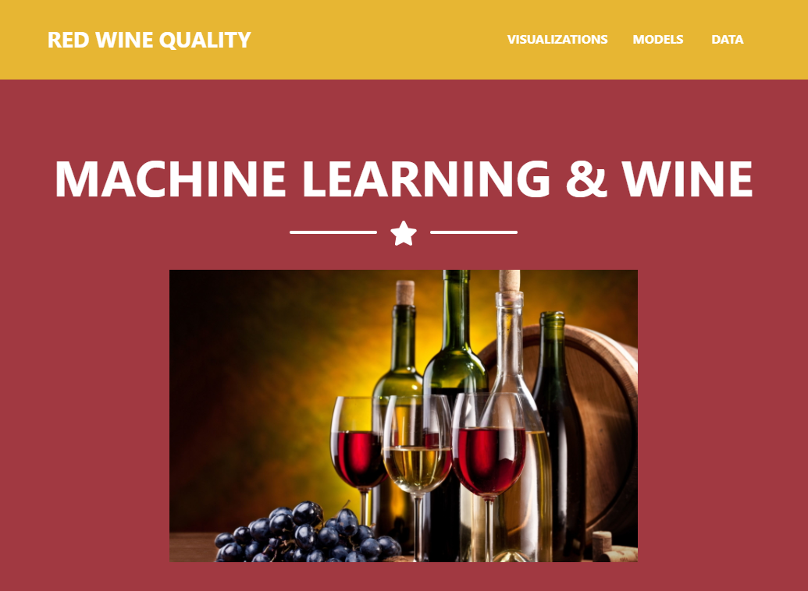
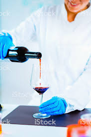
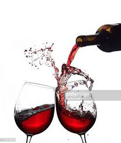

# Demystifying Machine Learning (ML)
### Final Project
Project Team 8: 
* Lori Shannon
* Philip Hill
* Rob Gauer
# 
# Red Wine Quality 

## Objective - Create an analysis of existing data to make a prediction, classification, or regression.
#
## Story - How do the physicochemical factors affect Red Wine quality?
Wine is a (delicious) alcoholic drink that dates back to 5000 BC.

The red-wine production process involves the extraction of color and flavor components from the grape skin. Red wine is made from dark-colored grape varieties.

Winemakers are investing in new technologies to improve the quality of wines. By assessing the most influential factors through physicochemical tests, we can use the outcomes to determine the relationship of the factors to the quality rating of the final wine produced.

After assembling the dataset, we used Python Pandas and Matplotlib to examine existing data on wine quality and then employed machine learning for regressions and predictions. Additionally, we include Tableau vizualizations based on the existing data to show the factors our machine learning models were based on.
 
#
## Analysis
Our team prepared a 15-minute data walktrough of how Machine Learning can describe how three different ingrediants affect the quality of red wine. The three physicochemical factors used in the analysis are volatile acidity, pH, and alcohol.

The following Machine Learning methods were used to predict and classify how the different types of physicochemical factors affect overall red wine quality.
   
   Machine Learning components:
   * Multiple Linear Regression.
      * Simply means that you have more than one feature (independant) variable.
        * The definition of Linear Regression:  A regression line is simply calculating a line that best fits the data. This is typically done through the least squares method where the line is chosen to have the smallest overall distance to the points. (y=mx+b)
      * Residuals (The plots for MLR are called a Residual Plot)
        * Because we can't easily plot our line in 3D space, we can use a residual plot to check our predictions. Residuals are the difference between the true values of y and the predicted values of y. 
          Source: Interpreting Residual Plots. https://www.qualtrics.com/support/stats-iq/analyses/regression-guides/interpreting-residual-plots-improve-regression/    
            

   * Logistic Regression.
      * Logistic Regression is a statistical method for predicting binary outcomes from data.
        * Examples of this are "yes" vs "no" or "young" vs "old".
          These are categories that translate to probability of being a 0 or a 1.

   * Neural Network.
      * A neural network is a series of algorithms that endeavors to recognize underlying relationships in a set of data through a process that mimics the way the human brain operates. Neural networks can adapt to changing input; so the network generates the best possible result without needing to redesign the output criteria.

   * Tableau.
      * Tableau can help anyone see and understand their data. It comes with tools that allow to drill down data and see the impact in a visual format that can be easily understood by any individual.
#  
## Team Repository
  * https://github.com/hockeylori/FinalProject-Team8
  * Launch the following web link for the project presentation:  
      * https://hockeylori.github.io/FinalProject-Team8/index.html
#
## Data Sources & Information Reference
   * UCI Machine Learning Repository. https://archive.ics.uci.edu/ml/datasets/Wine+Quality 
   * Data source of origin: https://archive.ics.uci.edu/ml/machine-learning-databases/wine-quality/
   * Link: https://archive.ics.uci.edu/ml/machine-learning-databases/wine-quality/winequality-red.csv
   * Attribute Information:
      * Input variables (based on physicochemical tests):
          1 - fixed acidity
          2 - volatile acidity
          3 - citric acid
          4 - residual sugar
          5 - chlorides
          6 - free sulfur dioxide
          7 - total sulfur dioxide
          8 - density
          9 - pH
          10 - sulphates
          11 - alcohol
      * Output variable (based on sensory data):
          12 - quality (score between 0 and 10)
#           
## Requirements Overview
  1. Data & Visualization components used in our project include:
      * Python Flask, HTML/CSS, Python Pandas, Jupyter Notebook, Python Matplotlib, Tableau, and GitHub IO. 
  2. Scikit-Learn and/or another machine learning library.

#
## Functional Work Flow 
  1. Dataset CSV file is reviewed and prepared: ../assets/winequality-red.csv 
  2. Python Jupyter Notebook and Matplotlib plot files for each machine learning technology used.
  3. Tableau used for visualization. Functional review of dataset for quick review of described visualizations.
  4. Published via GitHub IO for presentation of our data visualization of ML components to tell the story.
      * Link:  https://hockeylori.github.io/FinalProject-Team8/index.html
  #
## Visualizations
  * Web site Home Page URL and Selection Dropdown Menus.
    * https://hockeylori.github.io/FinalProject-Team8/index.html
  * Individual visualization files:
    * https://github.com/hockeylori/FinalProject-Team8/tree/master/assets/images

# 
### Data Analytics & Visualization 
 Lori Shannon, Philip Hill, Rob Gauer.
# 

#
#
# FINAL PROJECT INSTRUCTIONS

# Demystifying Machine Learning (ML)

## REQUIREMENTS
1. Find a problem worth solving, analyzing, or visualizing.
2. Use ML in the context of technologies learned.
3. You must use: Scikit-Learn and/or another machine learning library.
4. You must use at least two of the below:
    * Python, Pandas, Python Matplotlib, 
    * HTML/CSS/Bootstrap, JavaScript Plotly, JavaScript D3.js, JavaScript Leaflet, 
    * SQL Database, MongoDB Database, 
    * Goodle Cloud SQL, Amazon AWS, Tableau.
5. Host application using Heroku or a tool of your choice.
6. Prepare a 15-minute presentation data deep-dive or infrastructure walkthrough that shows machine learning in the context of what we’ve already learned. 
#

# 
### Copyright
Trilogy Education Services © 2019. All Rights Reserved.
# 